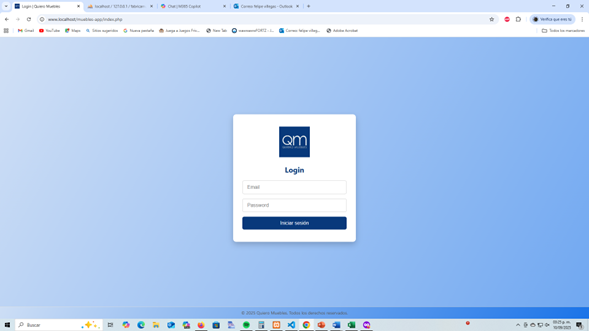
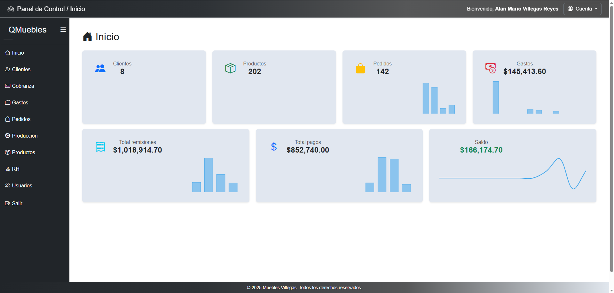
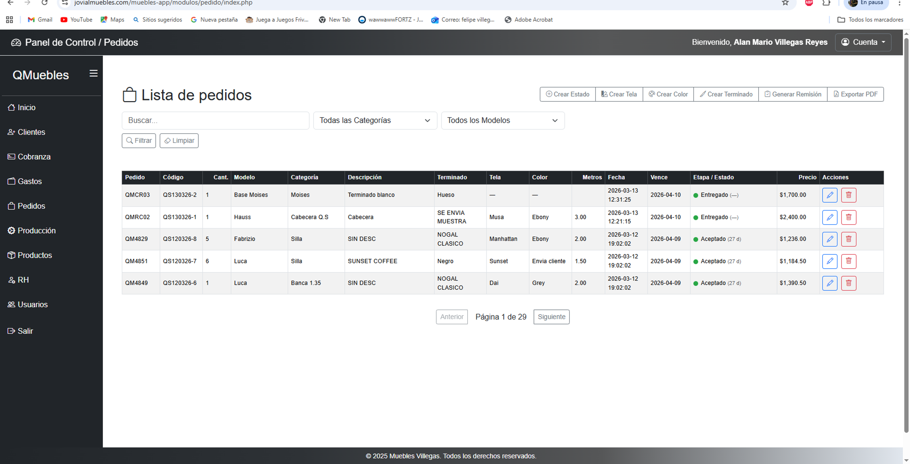
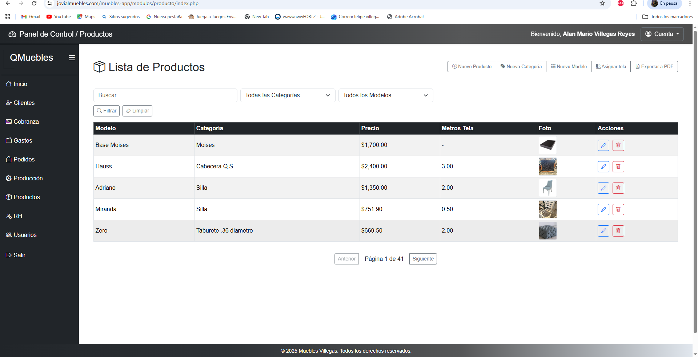
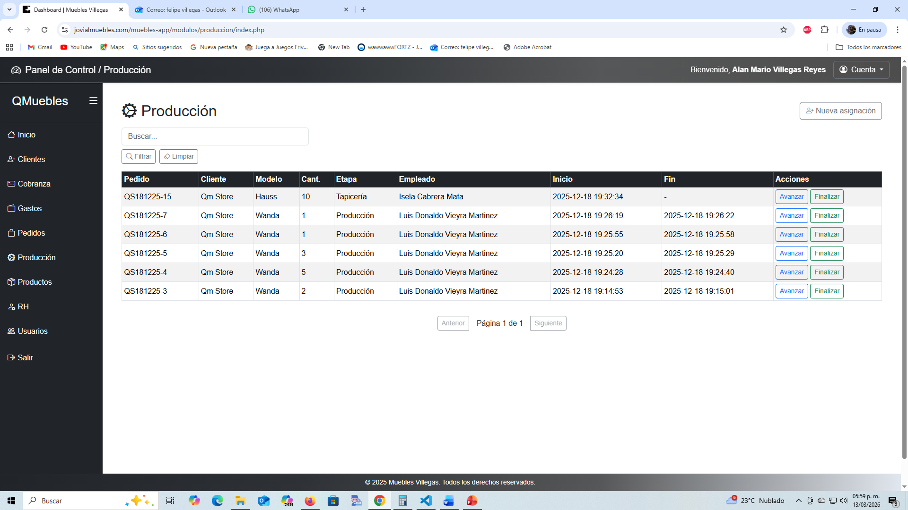
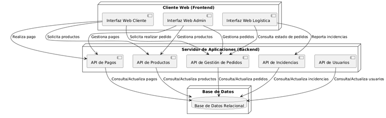

# Manufacturing Management System

## Overview

Manufacturing Management System is a web application designed to help small manufacturing businesses manage their daily operations.

The system centralizes product management, customer orders, production tracking and payment control in a single platform.

Originally developed for a furniture manufacturing company, the system is currently used in real operational workflows.

Web-based management system designed for small and medium manufacturing companies.

This platform helps manage production workflows, orders, customers, and internal operations through a centralized system.

The system was originally developed to improve operational control in a furniture manufacturing company and is currently used in real production environments.

---

## Features

- Product management
- Customer management
- Order management
- Production tracking
- Payment and collection management
- User roles and permissions
- Administrative dashboard

---

## Modules

The system is organized into several operational modules:

### Products
Manage product catalog, categories and models.

### Orders
Register and track customer orders, delivery dates and order status.

### Customers
Maintain customer information and order history.

### Production
Track production progress and workflow inside the factory.

### Payments / Collections
Monitor payments and outstanding balances.

### User Management
Role-based access control for different system users.

---

## Technology Stack

Backend:
- PHP (MVC architecture)

Frontend:
- HTML
- CSS
- JavaScript
- Bootstrap
- AJAX

Database:
- MySQL

Development approach:
- Agile methodology (Scrum)
- Iterative development
- UML diagrams for system design
- White-Box Testing
- Black-Box testing

---

## System Architecture

The system follows a Model-View-Controller (MVC) architecture to separate business logic, presentation and data management.

Example structure:

controllers
models
views
config
public

AJAX is used to improve the user experience by updating data dynamically without full page reloads.

---

## Business Context

This system was created to solve real operational challenges inside a manufacturing environment, including:

- order tracking
- production control
- customer management
- administrative process automation

The platform reduced operational errors and improved internal process visibility.

---

## Future Vision

The long-term goal is to evolve this platform into a SaaS solution for small manufacturing companies that need simple and affordable production management tools.

---
## Screenshots

### Login

### Dashboard

### Orders Module

### Products Module

### Production Tracking

---
## Architecture

The system follows an MVC architecture.

---

## Author

Alan Mario Villegas Reyes

Software Developer

GitHub:
https://github.com/alan090986
